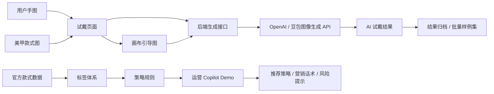
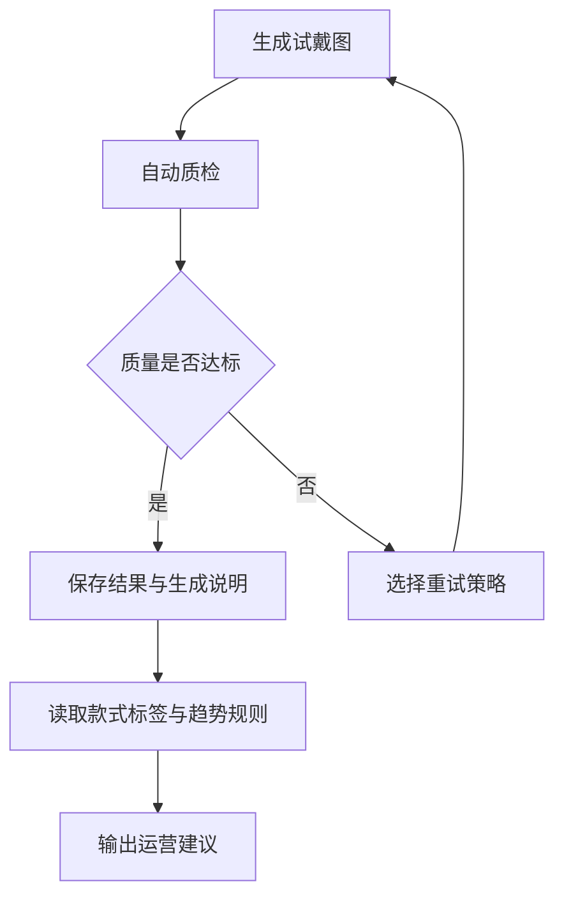

# 美甲 AI 试戴与智能运营 Agent MVP

一个面向美甲服务场景的 AI 工程 MVP：用户可以上传手部照片和美甲款式图，快速生成试戴效果；运营侧可以基于款式标签、趋势规则和 Copilot Demo 生成推荐策略、营销话术与风险提示。

项目定位不是重新训练图像分割模型，而是验证一条适合小数据场景快速落地、可评测、可迭代的工程路径：

> 多模态生成 API + 可控试戴引导图 + 批量样例生成 + 运营标签体系 + 规则型 Agent Copilot

## 项目亮点

- **AI 试戴闭环雏形**：支持手图、款式图、画布引导图三输入，后端调用 OpenAI 或豆包/火山方舟生成上手效果图。
- **官方样例一键加载**：可从官方评测表读取手图和款式图 URL，在本地页面快速加载样例试戴。
- **批量生成与重试机制**：支持官方配对样例批量生成，并针对贴合偏移、风格缺失等 bad case 使用质量重试 prompt。
- **智能运营 Copilot**：基于 25 个官方款式的标签数据，输出推荐款式、运营话术、行动建议和风险提示。
- **工程化可复现**：包含 `.env.example`、批处理脚本、结果 manifest、策略规则 JSON、质量报告和 GitHub 安全忽略配置。

## 业务背景

美甲服务中存在两个核心痛点：

- 用户侧：图片好看但难以想象上手效果，担心肤色、手型、甲型不匹配，导致决策周期长。
- 运营侧：款式库存多，人工统计热度和趋势滞后，推荐策略粗放，容易错过最佳运营窗口。

本项目用一个可运行 MVP 验证：先让用户“看得见效果”，再让运营“看得见趋势”，最终把试戴生成、质量检查、运营推荐串成可迭代 Agent 工作流。

## 系统架构



## Agent Workflow 流程

当前版本已经完成生成、批量样例、自动质检、重试计划和运营 Copilot 的基础闭环。Workflow 默认运行在安全模式下：先复用已有试戴结果做质量评估和重试规划，不会自动消耗图像生成 API 额度。



核心流程：

- `scripts/batch_generate_official_pairs.py` 负责调用图像生成 API，生成官方配对试戴结果并保存 manifest。
- `scripts/evaluate_tryon_results.py` 负责自动质检，输出 `pass`、`review`、`fail` 三类质量状态。
- `scripts/run_tryon_agent_workflow.py` 负责串联质检结果、重试候选、结果归档和运营动作建议。
- `scripts/build_ops_daily_report.py` 负责汇总热度、质检队列和工作流结果，生成运营日报。

自动重试时，Workflow 会按失败信号分组后自动选择 preset，再调用生成接口并重新质检：

- `alignment`：位置偏移、边界漂移、贴合不稳。
- `style`：款式应用太弱、图案不够明显。
- `detail`：有款式但细节不足，需要强化显色和装饰。
- `preserve`：全局漂移偏大，但要优先保住手部结构、肤色和背景。
- `mixed`：缺失、失败或多种信号混合。

## 功能模块

| 模块 | 状态 | 说明 |
| :--- | :--- | :--- |
| 试戴页面 | 已完成 | 上传手图、款式图，调整指甲位置，生成画布预览 |
| AI 生成接口 | 已完成 | `POST /api/generate-tryon`，支持 OpenAI 和豆包/火山方舟 |
| 官方样例加载 | 已完成 | `GET /api/official-samples`，读取官方评测表 URL |
| 用户个性化推荐 | 已完成 | `POST /api/user-style-recommendations`，基于用户画像推荐 Top 5 款式并支持一键试戴 |
| 批量生成脚本 | 已完成 | 按官方手图-款式配对生成结果图 |
| 质量重试 prompt | 已完成 | 支持 alignment、style、mixed 三类重试预设 |
| 款式标签体系 | 已完成 | 对官方款式做运营标签初稿 |
| 运营 Copilot | 已完成 | `POST /api/ops-copilot-demo`，输出推荐和运营策略 |
| API 调用日志 | 已完成 | 记录 requestId、provider、模型、耗时、失败原因和重试信息 |
| 自动质检模块 v1 | 已完成 | 规则评估输出存在性、尺寸、文件大小、场景漂移和重试候选 |
| Agent Workflow v1 | 已完成 | 复用已有结果，自动串联质检、重试计划、归档摘要和运营动作 |
| 运营日报生成 | 已完成 | 汇总 mock 热度、质检队列和 Workflow，输出趋势洞察、运营动作和风险提示 |

## 本地运行

环境要求：

- Node.js 18+
- Python 3.9+
- 可选：OpenAI API Key 或火山方舟/豆包 API Key

启动服务：

```bash
cd D:\MVP
npm start
```

打开页面：

- 试戴页：`http://localhost:3000/index.html`
- 运营页：`http://localhost:3000/ops.html`

如果本地 3000 端口被占用，可以指定端口：

```powershell
$env:PORT="3101"
npm start
```

## API 配置

复制 `.env.example` 为 `.env.local`，至少配置一个图像生成服务。

```bash
OPENAI_API_KEY=
ARK_API_KEY=
DOUBAO_API_KEY=
DOUBAO_IMAGE_MODEL=
DOUBAO_IMAGE_VERSION=
LLM_API_KEY=
LLM_API_BASE=https://api.openai.com/v1
LLM_MODEL=gpt-4o-mini
VLM_API_KEY=
VLM_API_BASE=https://api.openai.com/v1
VLM_MODEL=gpt-4o-mini
API_CALL_LOG_PATH=logs/api-calls.jsonl
```

官方样例加载需要配置评测表路径：

```bash
OFFICIAL_WORKBOOK_PATH=D:\Manicure\命题三美甲评测数据（对外版）.xlsx
OFFICIAL_SAMPLES_PYTHON=python
```

安全说明：`.env.local` 已在 `.gitignore` 中排除，不应提交到 GitHub。

## API 调用日志

每次调用 `POST /api/generate-tryon` 都会写入一条 JSONL 日志：

```bash
logs/api-calls.jsonl
```

日志会记录：

- `requestId`：单次请求 ID，前端响应和服务端日志可对齐。
- `provider` / `requestedModel`：本次使用的服务商和模型。
- `durationMs` / `status`：耗时与成功或失败状态。
- `retry.attempt` / `retry.preset`：是否为批量生成中的质量重试。
- `inputSources` / `inputAssets`：输入图片来源类型、尺寸和哈希摘要。
- `error.message`：失败原因，便于定位模型权限、网络或参数问题。

日志不会写入 API Key，也不会保存图片 base64 原文；`logs/` 目录已被 `.gitignore` 排除。

这些日志可以作为后续 Agent 迭代优化的数据来源：

- 统计不同 provider / model 的成功率、耗时和失败原因。
- 聚类 bad case，分析常见失败类型，例如贴合偏移、款式缺失、手部结构漂移。
- 优化重试策略，根据失败原因选择 alignment、style 或 mixed prompt。
- 对比不同模型或参数组合的稳定性，形成更可靠的生成策略。

## 用户个性化推荐

试戴页包含一个轻量推荐模块，用户可以选择肤色、手型、场景、偏好风格、甲长和预算，后端接口会返回推荐款式 Top 5：

```text
POST /api/user-style-recommendations
```

推荐依据：

- 官方款式标签：颜色、风格、场景、人群、价格带、趋势关键词。
- Mock 热度数据：[data/mock_style_popularity.json](data/mock_style_popularity.json)。
- 试戴质检结果：[analysis/tryon_quality_v1/tryon_quality_report.json](analysis/tryon_quality_v1/tryon_quality_report.json)。
- 用户画像：肤色、手型、甲长偏好、使用场景、预算和风格偏好。

注意：当前热度数据是 mock 数据，用于验证推荐闭环；正式上线后应替换为真实曝光、点击、收藏、试戴、预约和成交数据。

## 自动质检与质量评估

自动质检由项目脚本 `scripts/evaluate_tryon_results.py` 完成。默认先使用规则系统兜底，不依赖人工逐张判断，也不消耗大模型额度。它读取批量生成结果和官方样例信息，对每张试戴图给出质量状态与问题原因：

- `pass`：基础质量达标，可进入展示或运营分析。
- `review`：存在潜在问题，需要人工复核或加入重试队列。
- `fail`：结果缺失、尺寸异常或明显不满足基础要求，需要重新生成。

当前 v1 质检规则主要检查：

- 输出文件是否存在，文件大小是否异常。
- 图片尺寸和宽高比是否符合预期。
- 与原手图相比是否发生明显场景漂移。
- 预估指甲区域是否有足够视觉变化，用于判断款式是否可能贴到指甲区域。

如果配置了 OpenAI-compatible 多模态模型，也可以启用 VLM 质检增强：

```bash
npm run evaluate:tryon:vlm
```

VLM 质检会在规则评分基础上检查指甲贴合、覆盖度、手部保真和款式一致性，并可将 `pass` 升级为 `review` 或 `fail`。这种设计保证了“规则系统兜底 + 多模态大模型加严判断”：没有模型时仍可离线评估，有模型时提升对位置偏差和风格缺失的识别能力。

## 运营建议与日报生成

运营建议面向商家或平台运营人员，不直接展示给普通用户。它用于回答“哪些款式值得主推、应该怎么推、有哪些质量或库存风险”。

当前运营建议由规则型 Copilot 生成，主要数据来源包括：

- 官方款式标签：[data/official_style_label_draft_v1.csv](data/official_style_label_draft_v1.csv)，包含颜色、风格、场景、人群、价格带和趋势关键词。
- Mock 热度数据：[data/mock_style_popularity.json](data/mock_style_popularity.json)，用于模拟浏览、收藏、试戴和预约等热度信号。
- 质检报告：[analysis/tryon_quality_v1/tryon_quality_report.md](analysis/tryon_quality_v1/tryon_quality_report.md)，用于识别不适合直接主推的低质量试戴结果。
- Agent Workflow 报告：[analysis/tryon_agent_workflow_v1/tryon_agent_workflow.md](analysis/tryon_agent_workflow_v1/tryon_agent_workflow.md)，用于同步重试队列、归档摘要和运营动作。

运营日报通过 `npm run report:ops` 生成，输出趋势洞察、主推款式、行动建议和风险提示。也可以开启 LLM 运营策略增强：

```bash
npm run report:ops:llm
```

规则层负责给出可解释的推荐依据和质量门禁，LLM 层只基于规则日报生成更自然的活动文案、人群动作、实验计划和风险控制，不直接伪造热度或用户行为。当前版本不声称使用真实用户行为数据；正式上线后应将 mock 热度替换为真实埋点数据，包括曝光、点击、收藏、试戴、加购、预约和成交。

## 日志驱动 Agent 迭代

API 调用日志可以通过脚本转成 Agent 迭代建议：

```bash
npm run analyze:agent-logs
```

输出：

- `analysis/agent_log_insights_v1/agent_log_insights.json`
- `analysis/agent_log_insights_v1/agent_log_insights.md`

日志分析会统计成功率、失败类型、模型配置错误、限流、平均耗时和重试 preset 分布，并生成下一轮优化建议。例如：模型未开通时提示增加启动前检查，位置偏移重试较多时提示强化 alignment prompt，耗时过高时提示区分预览和正式生成配置。

## 试戴与运营闭环

本项目将试戴能力和运营能力放在同一套系统中，但保持模块边界清晰：

- 用户侧负责上传手图、选择偏好、查看试戴效果，并触发个性化推荐。
- 运营侧负责观察款式热度、质检结果和转化信号，决定主推款式与营销策略。
- Agent Workflow 负责把生成结果、质量评估、重试计划和运营建议串起来，形成可迭代闭环。

因此，“根据用户手型、肤色、场景和款式热度推荐美甲并试戴”属于用户侧推荐；“根据整体热度、质量和库存制定主推策略”属于运营侧策略。两者共享款式标签、热度数据和质检结果，但服务对象不同。

## 常用脚本

批量生成官方配对样例：

```bash
npm run batch:official
```

只生成少量样例并保存引导图：

```bash
python scripts/batch_generate_official_pairs.py --limit 3 --save-guides
```

对指定 bad case 做质量重试：

```bash
python scripts/batch_generate_official_pairs.py --pairs hand_01_style_01,hand_03_style_03 --quality-retry-attempts 2 --retry-preset mixed --overwrite
```

导出款式标签模板：

```bash
npm run labels:styles
```

生成运营分析摘要：

```bash
npm run analyze:styles
```

生成运营策略规则：

```bash
npm run strategy:ops
```

生成试戴结果质量评估报告：

```bash
npm run evaluate:tryon
```

启用多模态大模型质检增强：

```bash
npm run evaluate:tryon:vlm
```

输出：

- `analysis/tryon_quality_v1/tryon_quality_report.json`
- `analysis/tryon_quality_v1/tryon_quality_report.md`

运行安全版 Agent Workflow：

```bash
npm run workflow:tryon
```

输出：

- `analysis/tryon_agent_workflow_v1/tryon_agent_workflow.json`
- `analysis/tryon_agent_workflow_v1/tryon_agent_workflow.md`

自动执行重试并刷新日报：

```bash
python scripts/run_tryon_agent_workflow.py --auto-retry --refresh-ops-report
```

生成智能运营日报：

```bash
npm run report:ops
```

启用 LLM 运营策略增强：

```bash
npm run report:ops:llm
```

输出：

- `analysis/ops_daily_report_v1/ops_daily_report.json`
- `analysis/ops_daily_report_v1/ops_daily_report.md`

分析 API 日志并输出 Agent 迭代建议：

```bash
npm run analyze:agent-logs
```

输出：

- `analysis/agent_log_insights_v1/agent_log_insights.json`
- `analysis/agent_log_insights_v1/agent_log_insights.md`

## 关键产物

- 试戴前端：[public/index.html](public/index.html)
- 运营前端：[public/ops.html](public/ops.html)
- 后端服务：[server.mjs](server.mjs)
- 批量生成脚本：[scripts/batch_generate_official_pairs.py](scripts/batch_generate_official_pairs.py)
- Mock 热度数据：[data/mock_style_popularity.json](data/mock_style_popularity.json)
- 款式标签草稿：[data/official_style_label_draft_v1.csv](data/official_style_label_draft_v1.csv)
- 运营策略规则：[analysis/ops_strategy_v1/ops_strategy_rules_v1.md](analysis/ops_strategy_v1/ops_strategy_rules_v1.md)
- 试戴质检报告：[analysis/tryon_quality_v1/tryon_quality_report.md](analysis/tryon_quality_v1/tryon_quality_report.md)
- Agent Workflow 报告：[analysis/tryon_agent_workflow_v1/tryon_agent_workflow.md](analysis/tryon_agent_workflow_v1/tryon_agent_workflow.md)
- 运营日报：[analysis/ops_daily_report_v1/ops_daily_report.md](analysis/ops_daily_report_v1/ops_daily_report.md)
- Agent 日志洞察：[analysis/agent_log_insights_v1/agent_log_insights.md](analysis/agent_log_insights_v1/agent_log_insights.md)
- Copilot 说明：[analysis/ops_copilot_v1/README.md](analysis/ops_copilot_v1/README.md)
- 官方样例输出：[outputs/official-paired](outputs/official-paired)

## 示例结果

官方配对样例输出保存在 `outputs/official-paired/20260601-201746`。例如：


## 后续路线图

1. **自动执行重试**：在预算阈值和最大重试次数可控的前提下，让 Workflow 自动执行重试命令并重新评估。
2. **视觉质检升级**：接入手部关键点、指甲区域检测或多模态评分模型，提升对贴合偏移、覆盖度和风格一致性的判断能力。
3. **真实运营数据接入**：将 mock 热度替换为真实曝光、点击、收藏、试戴、预约和成交数据，形成可持续更新的趋势监控。
4. **LLM Copilot 升级**：在保留规则可解释性的基础上，用 LLM 生成更自然的运营文案和实验复盘。
5. **数据库与可观测性**：将 JSONL 日志升级为数据库存储，支持按 requestId、款式、模型、失败类型和重试次数检索。

## 设计取舍

本项目的第一阶段没有训练图像分割模型，原因是官方数据量较小，比赛和作品集阶段更适合优先验证产品闭环。当前方案的边界是：生成质量依赖外部图像模型，复杂手势或遮挡场景仍可能出现贴合偏差。因此后续重点会放在自动质检、失败重试和 Agent 迭代能力上。
