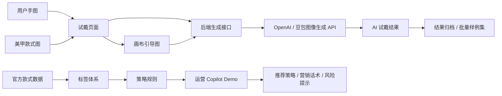
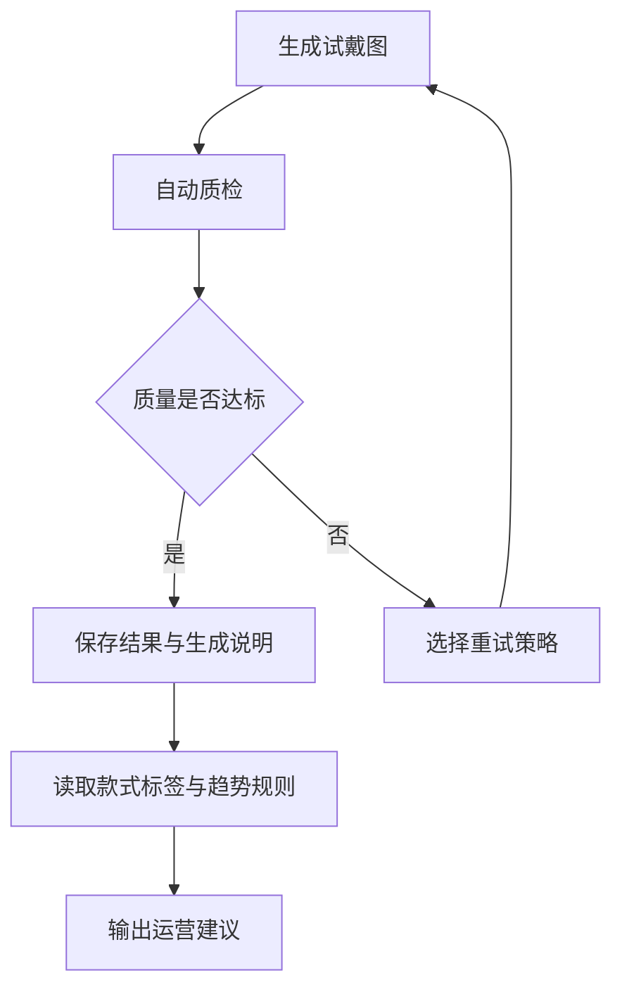

# 美甲 AI 试戴与智能运营 Agent MVP

一个面向美甲服务场景的 AI 工程 MVP：用户可以上传手部照片和美甲款式图，快速生成试戴效果；运营侧可以基于款式标签、趋势规则和 Copilot Demo 生成推荐策略、营销话术与风险提示。

项目定位不是重新训练图像分割模型，而是验证一条更适合比赛和实习作品展示的落地路径：

> 多模态生成 API + 可控试戴引导图 + 批量样例生成 + 运营标签体系 + 规则型 Agent Copilot

## 项目亮点

- **AI 试戴闭环雏形**：支持手图、款式图、画布引导图三输入，后端调用 OpenAI 或豆包/火山方舟生成上手效果图。
- **官方样例一键加载**：可从官方评测表读取手图和款式图 URL，在本地页面快速加载样例试戴。
- **批量生成与重试机制**：支持官方配对样例批量生成，并针对贴合偏移、风格缺失等 bad case 使用质量重试 prompt。
- **智能运营 Copilot**：基于 25 个官方款式的标签数据，输出推荐款式、运营话术、行动建议和风险提示。
- **工程化可复现**：包含 `.env.example`、批处理脚本、结果 manifest、策略规则 JSON、比赛提交说明和 GitHub 安全忽略配置。

## 业务背景

美甲服务中存在两个核心痛点：

- 用户侧：图片好看但难以想象上手效果，担心肤色、手型、甲型不匹配，导致决策周期长。
- 运营侧：款式库存多，人工统计热度和趋势滞后，推荐策略粗放，容易错过最佳运营窗口。

本项目用一个可运行 MVP 验证：先让用户“看得见效果”，再让运营“看得见趋势”，最终把试戴生成、质量检查、运营推荐串成可迭代 Agent 工作流。

## 系统架构



## Agent Workflow 规划

当前版本已经完成生成、批量样例、重试和运营 Copilot 的基础能力。后续会继续升级成完整 Agent 闭环：



## 功能模块

| 模块 | 状态 | 说明 |
| :--- | :--- | :--- |
| 试戴页面 | 已完成 | 上传手图、款式图，调整指甲位置，生成画布预览 |
| AI 生成接口 | 已完成 | `POST /api/generate-tryon`，支持 OpenAI 和豆包/火山方舟 |
| 官方样例加载 | 已完成 | `GET /api/official-samples`，读取官方评测表 URL |
| 批量生成脚本 | 已完成 | 按官方手图-款式配对生成结果图 |
| 质量重试 prompt | 已完成 | 支持 alignment、style、mixed 三类重试预设 |
| 款式标签体系 | 已完成 | 对官方款式做运营标签初稿 |
| 运营 Copilot | 已完成 | `POST /api/ops-copilot-demo`，输出推荐和运营策略 |
| API 调用日志 | 已完成 | 记录 requestId、provider、模型、耗时、失败原因和重试信息 |
| 自动质检模块 | 规划中 | 计划加入覆盖度、偏移、结构保真、风格一致性评分 |

## 本地运行

环境要求：

- Node.js 18+
- Python 3.9+
- 可选：OpenAI API Key 或火山方舟/豆包 API Key

启动服务：

```bash
cd D:\MVP
npm start
```

打开页面：

- 试戴页：`http://localhost:3000/index.html`
- 运营页：`http://localhost:3000/ops.html`

如果本地 3000 端口被占用，可以指定端口：

```powershell
$env:PORT="3101"
npm start
```

## API 配置

复制 `.env.example` 为 `.env.local`，至少配置一个图像生成服务。

```bash
OPENAI_API_KEY=
ARK_API_KEY=
DOUBAO_API_KEY=
DOUBAO_IMAGE_MODEL=
DOUBAO_IMAGE_VERSION=
API_CALL_LOG_PATH=logs/api-calls.jsonl
```

官方样例加载需要配置评测表路径：

```bash
OFFICIAL_WORKBOOK_PATH=D:\Manicure\命题三美甲评测数据（对外版）.xlsx
OFFICIAL_SAMPLES_PYTHON=python
```

安全说明：`.env.local` 已在 `.gitignore` 中排除，不应提交到 GitHub。

## API 调用日志

每次调用 `POST /api/generate-tryon` 都会写入一条 JSONL 日志：

```bash
logs/api-calls.jsonl
```

日志会记录：

- `requestId`：单次请求 ID，前端响应和服务端日志可对齐。
- `provider` / `requestedModel`：本次使用的服务商和模型。
- `durationMs` / `status`：耗时与成功或失败状态。
- `retry.attempt` / `retry.preset`：是否为批量生成中的质量重试。
- `inputSources` / `inputAssets`：输入图片来源类型、尺寸和哈希摘要。
- `error.message`：失败原因，便于定位模型权限、网络或参数问题。

日志不会写入 API Key，也不会保存图片 base64 原文；`logs/` 目录已被 `.gitignore` 排除。

## 常用脚本

批量生成官方配对样例：

```bash
npm run batch:official
```

只生成少量样例并保存引导图：

```bash
python scripts/batch_generate_official_pairs.py --limit 3 --save-guides
```

对指定 bad case 做质量重试：

```bash
python scripts/batch_generate_official_pairs.py --pairs hand_01_style_01,hand_03_style_03 --quality-retry-attempts 2 --retry-preset mixed --overwrite
```

导出款式标签模板：

```bash
npm run labels:styles
```

生成运营分析摘要：

```bash
npm run analyze:styles
```

生成运营策略规则：

```bash
npm run strategy:ops
```

## 关键产物

- 试戴前端：[public/index.html](public/index.html)
- 运营前端：[public/ops.html](public/ops.html)
- 后端服务：[server.mjs](server.mjs)
- 批量生成脚本：[scripts/batch_generate_official_pairs.py](scripts/batch_generate_official_pairs.py)
- 款式标签草稿：[data/official_style_label_draft_v1.csv](data/official_style_label_draft_v1.csv)
- 运营策略规则：[analysis/ops_strategy_v1/ops_strategy_rules_v1.md](analysis/ops_strategy_v1/ops_strategy_rules_v1.md)
- Copilot 说明：[analysis/ops_copilot_v1/README.md](analysis/ops_copilot_v1/README.md)
- 官方样例输出：[outputs/official-paired](outputs/official-paired)
- 比赛提交说明：[比赛提交说明.md](比赛提交说明.md)

## 示例结果

官方配对样例输出保存在 `outputs/official-paired/20260601-201746`。例如：


## 适合在面试中强调的能力点

- 将开放式业务题拆成可运行 MVP，而不是停留在概念方案。
- 在不训练模型的前提下，利用多模态 API 和引导图降低试戴生成难度。
- 通过批量生成、结果归档和重试 prompt 建立可迭代实验流程。
- 将图片款式转为结构化运营标签，再用规则型 Copilot 生成推荐策略。
- 保留后续升级空间：自动质检、日志追踪、LLM Agent、在线 Demo。

## 后续路线图

1. **自动质检 v1**：先做规则版质量评分，包括输出存在性、尺寸异常、颜色偏移、结构保真等。
2. **Agent 闭环**：把生成、质检、重试、归档、运营建议串成一个端到端工作流。
3. **在线 Demo / 录屏**：部署稳定版本，并准备 1-2 分钟项目演示视频。
4. **LLM Copilot 升级**：在保留规则可解释性的基础上，用 LLM 生成更自然的策略文案。

## 设计取舍

本项目的第一阶段没有训练图像分割模型，原因是官方数据量较小，比赛和作品集阶段更适合优先验证产品闭环。当前方案的边界是：生成质量依赖外部图像模型，复杂手势或遮挡场景仍可能出现贴合偏差。因此后续重点会放在自动质检、失败重试和 Agent 迭代能力上。
